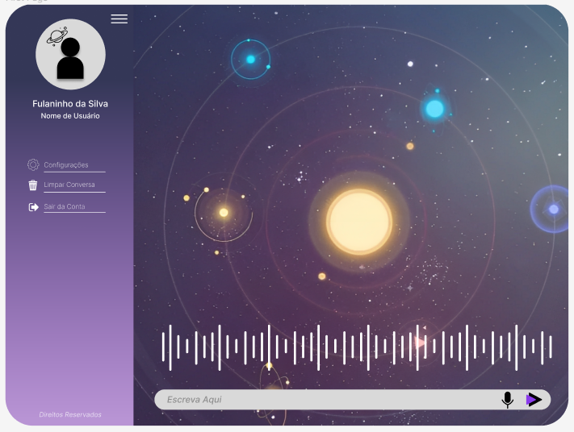

<h1 align="center">  Elysium </h1>

Seu Assistente Virtual!

  <a href="#-tecnologias">Tecnologias</a>&nbsp;&nbsp;&nbsp;|&nbsp;&nbsp;&nbsp;
  <a href="#-canva">Canva</a>&nbsp;&nbsp;&nbsp;|&nbsp;&nbsp;&nbsp;
  <a href="#-layout">Layout</a>&nbsp;&nbsp;&nbsp;|&nbsp;&nbsp;&nbsp;

 

  

## 🚀 Tecnologias

Esse projeto foi desenvolvido com as seguintes tecnologias:

- HTML e CSS
- Git e Github
- Visual studio code

## 💻 Canva

Para acessar o material do nosso Projeto acesse o link: [Canva](https://www.canva.com/design/DAFhHF6ewZU/EELDbuINJoLoI9Lln0ys0Q/edit?utm_content=DAFhHF6ewZU&utm_campaign=designshare&utm_medium=link2&utm_source=sharebutton)

## 🔖 Layout

Você pode visualizar o layout do projeto através [DESSE LINK](https://www.figma.com/file/AQDdB8toAUPney3ZTGaWOL/Design-do-Elysium?type=design&node-id=0-1&t=xs8vUPgeYBstjoab-0). É necessário ter conta no [Figma](https://figma.com) para acessá-lo.
